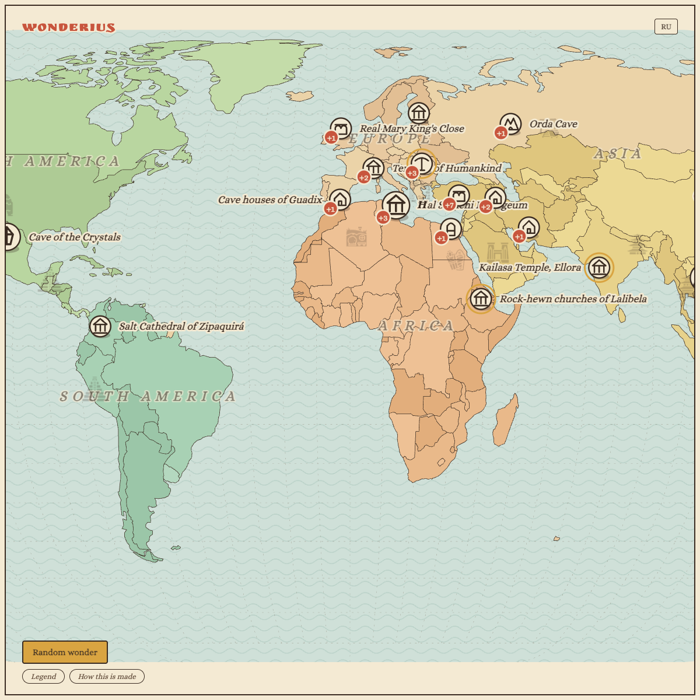

[English](README.md) · [Русский](README.ru.md)

# Wonderius



I was inspired by *Maps*, the book by Aleksandra and Daniel Mizielinski. I wanted to see wonders I thought existed only in fantasy.

There is a circle on the map. You press it and get a picture or a 3D model, a short story, and a link to where it comes from. The drawings are mine. Nothing is copied from the book. Photos and models name their authors.

Small icons on the sea: Delapouite and Lorc, game-icons.net, CC BY 3.0. Fonts: Alice and Ruslan Display, OFL.

## Build

```bash
npm install
npm run check
```

Then open `index.html` through a local server. Photos and 3D come from the network.
