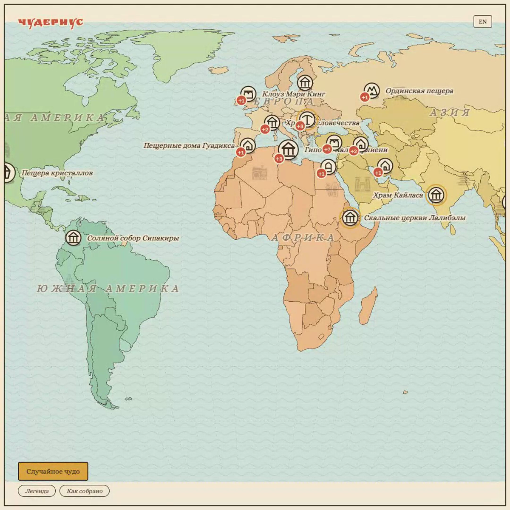

# Wonderius · Чудериус

**Атлас чудес мира**



Я люблю атласы. Видели «Карты» Мизелинских? Разворачиваешь лист, и мир вдруг не скучный. **Wonderius** — про то же чувство. Тыкаешь в кружок на карте, и сразу картинка или модель, которую можно покрутить, короткая история и ссылка, откуда это известно.

Тут вырезанные в камне города, пещеры, странные дома и то, что просто хочется потрогать. Не урок истории, не подземелье из игры и не военная карта.

Золотое кольцо значит: у места есть 3D. Красный плюс — в одной точке несколько чудес, нажми и выбери имя. Кнопка «Легенда» рядом с «Как собрано» это и показывает: нажал строку, чужие кружки тускнеют.

Фото и модели принадлежат авторам. У каждого кадра указаны автор, лицензия и страница источника. Рисунки на карте свои. У книги Мизелинских взяты дух и приёмы, не картинки. Мелкие значки на море — Delapouite и Lorc, game-icons.net, CC BY 3.0. Шрифты Alice и Ruslan Display лежат рядом, лицензия OFL.

Куратор: Андрей (lruns).

## Как это собрано

TypeScript, esbuild и d3. Без чужих шрифтов с CDN.

```bash
npm install
npm run check
```

Дальше открой `index.html` через локальный сервер. Фото и 3D подгружаются из сети, с диска по `file://` они не появятся.

Интерфейс по-русски и по-английски. Переключатель пишет в `localStorage` ключ `lruns-lang`, тот же, что на lruns.one.

---

*An atlas of wonders: tap a pin and get a picture or a 3D model, a short story, and the source. Drawings are original. Photos and models stay credited to their authors.*
