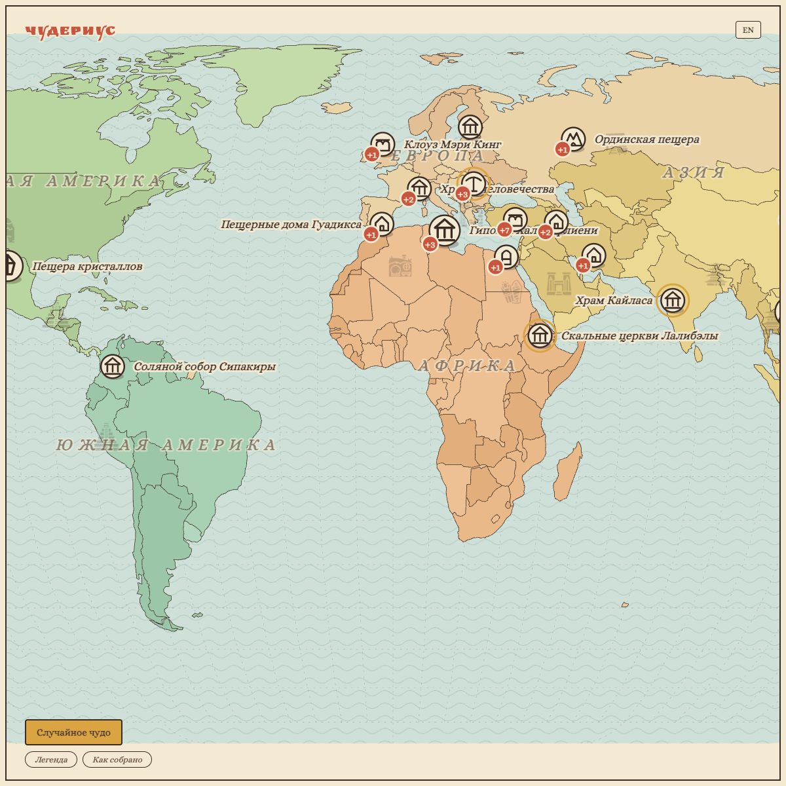

[English](README.md) · [Русский](README.ru.md)

# Wonderius



Я вдохновился книгой «Карты» Александры и Даниэля Мизелинских. Мне стало интересно увидеть чудеса, которые я думал бывают только в фэнтези.

На карте кружок. Нажимаешь — картинка или 3D, короткая история и ссылка, откуда это взято. Рисунки свои, из книги ничего не скопировано. У фото и моделей указаны авторы.

Мелкие значки на море: Delapouite и Lorc, game-icons.net, CC BY 3.0. Шрифты Alice и Ruslan Display, OFL.

## Как собрать

```bash
npm install
npm run check
```

Потом открой `index.html` через локальный сервер. Фото и 3D идут из сети.
